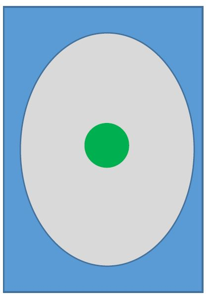

# FlightGear-Simulator-Android-App
An Android application designed to fly a FlightGear aircraft using a custom joystick.

In this app, I need to create two activity:
  1. Login Activity - connect to server (in this project we get the server, But you can connect to a flight simulator).
  2. Joystick Activity - a jostic that every move of him change the movement of the plan.
  
## Login Activity
A login window will appear where you start the program
 

 
```
IP: 10.0.2.2
Port: 5402 (corresponding to the port connected to the 'in' socket)
``` 
Once you are connected, the joystick screen will appear.

## Joystick Activity


Now you ready to move the plan with the joystick, 
Have a nice Flight!
